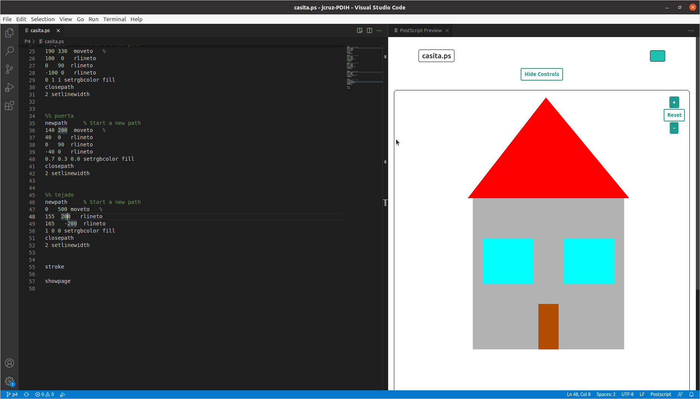

## Práctica 4 El lenguaje Postscript

### Referencias

Para la realización de esta práctica he utilizado esta página: http://www.physics.emory.edu/faculty/weeks//graphics/howtops2.html
Principalmente para conseguir algunas formas con los círculos y que me llevame a la [guía de los colores](http://www.physics.emory.edu/faculty/weeks//graphics/colorps.html)  

Para guiarme un poco de forma rápida con la posición de dónde iba poniendo cada cosa he usado un plugin para vscode: `PostScrit Previewer`  




Para cada práctica partiendo de los ejemplos del guión simplemente ha sido ir moviendo las cosas hasta dar con la posición que toca.

### Código usado de base

He usado básicamente 3 formas geométricas y he ido cambiando la posición y dimensiones, siendo estas:  

#### Rectángulo
Sacada la base de del guión, un ejemplo de este es:  
```PostScript
%% casa
newpath     % Start a new path
10 200  moveto   % 
300  0   rlineto
0   300  rlineto
-300 0   rlineto
0.7 setgray
fill
closepath
5 setlinewidth
```  

#### Triángulo
Ésta la he sacado viendo de la forma que funciona el rectángulo, de modo que al retornar al origen con `closepath` he visto que se puede hacer avanzando en `x` e `y` en el primer paso y cerrando omitiendo un lado, un ejemplo de este es:  
```PostScript
%% tejado
newpath     % Start a new path
0   500 moveto   % 
155  200   rlineto
165   -200  rlineto
1 0 0 setrgbcolor fill
closepath
2 setlinewidth
```  

#### Circulo
He sacado el ejemplo del guión, pero viendo cómo funciona he podido hacer semicírculos que es lo que he usado para el corazón, que quizás es la parte más interesante:  
```PostScript
newpath     % Start a new path
% x y R angI angF
100 300 100 0 180 arc
1 0 0 setrgbcolor fill
2 setlinewidth
stroke
```
